# Milestone-3-Project
# A restaurant website utilising Python and Django to create a reservation booking app. 

# Menu of contents
## 1. Deployment 
### 1. Live Site Link
### 2. Responsiveness Screenshots
## 2. Purpose of Project
## 3. User Stories
### 1. Must Haves
### 2. Should Haves
### 3. Could Haves
## 4. UX Design
## 5. UI Design
## 6. Testing
### 1. Coding Validation
### 2. Bugs Found and Resolved
## 7. Testing
## 8. Next Step Features
## 9. Coding Sources
## 10. Media sources
## 11. Acknowledgements
__________________
__________________
## 1. Deployment 
 Project was deployed using GitHub and Visual Studio and Heroku.

### 1. Live Site
https://milestone-3-ede96df867cb.herokuapp.com/home/

(https://ui.dev/amiresponsive)

### 2. Responsiveness Screenshots
## 2. Purpose
To create a wedbsite for a restaurant booking and user registration system using Python and Django (including static CSS, JS and HTML templates).  

## Criteria provided by Code Institute 
 
### External user’s goal: 
* The user would like to book one or more guests for a meal in a restaurant and
a particular time and date.

### Site owner's goal:
* The site owner would like the ability to take online bookings for their eatery.

### Features to include:

* Date/Time-based bookings
* Avoid double bookings
* Multiple table occupancies
* Cancellations
* Menu

### User stories
* As a user, I want to be able to find out information about the restaurant, including location and menus.
* As a user, I want the website to be simply presented and easily navigable. 
* As a user, I want to be able to register and log-in to the booking system.
* As a user, I want to be able to book a table online, providing extra information in a notes section if necessary, and recieve an email confirmation 

### 1. Must-haves
* User friendly navigation.
* Restaurant information including an introduction and an example menu
* A system through which a user can first register, log-in and then log-out. Any reservations made should then be linked to user.
* User shouldn't be able to book an already booked table.
* User shouldn't be able to book a table in the past. 
* User should recieve a confirmation email following booking.  

### 2. Should-haves
* User should be able to check previous and future reservations.
* User should be able to see reviews from previous diners. 
* Engaging visual design

### 3. Could-haves
* User could cancel bookings. 
* User could send messages to the restaurant outside of the booking system notes area. 

## 4. UX Design

### Strategy
The aim of the project is to create a functional user registration and table booking app using Django and Python, with front end design from HTML, CSS and JS.

The user will be able to navigate the website and book a table for the restaurant. 

### Scope
The project will consist of three main pages (Home, Menu/Reviews, Booking) as well as interim success/login pages.  
1. Homepage - Loading the page will bring the user to /home. Here there will be an introduction to the restaurant (The Wurst of Times) as well as links to book a table. A navbar at the top of the page will allow the user to navigate to other templates within the project.
2. Menu and Reviews - This page will house an example menu as well as reviews from previous diners. 
3. Book Your Table - This page will include a booking form with input and choice areas for customer name, table choice, reservation date, time slot, number of guests, additional notes for the restaurant and customer email. 

Additional/Interim pages for functionality

4. Sign Up - This page includes input areas for username, password and password confirmation. This page includes the rules provided by django.auth regaring username and password appropriateness. 
5. Log-in - A simple page through which a user can log in using their credentials. If they are not already registered, there is a link to register. 
6. Reservation Success - A simple interim page following a successful booking which links the user back to the home page. 

### Structure
(See wireframes section below)

### Skeleton
The user will navigate by clicking the links in the navbar menu (visible in tablet view and on desktop, collapsed on mobile devices).

### Entity Relationship Diagram (ERD)

The following diagram represents the database structure for the restaurant booking system:

## Tables Overview
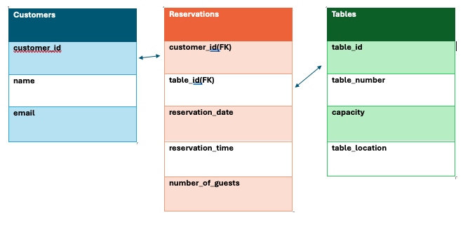

### Customers
Stores customer details for identifying and contacting guests.

* customer_id (PK)

* name

* email

### Tables
Represents the physical tables in the restaurant.

* table_id (PK)

* table_number

* capacity

* table_location (e.g., indoor, outdoor)

### Reservations
Links customers to tables with specific booking details.

* customer_id (FK → Customers)

* table_id (FK → Tables)

* reservation_date

* reservation_time

* number_of_guests

### Relationships

One Customer can make many Reservations.

One Table can have many Reservations (but only one per timeslot).

Once created, bookings can be viewed and amended via /admin through the use of a superuser log-in. Registered user details can also be viewed within the /admin portal. 
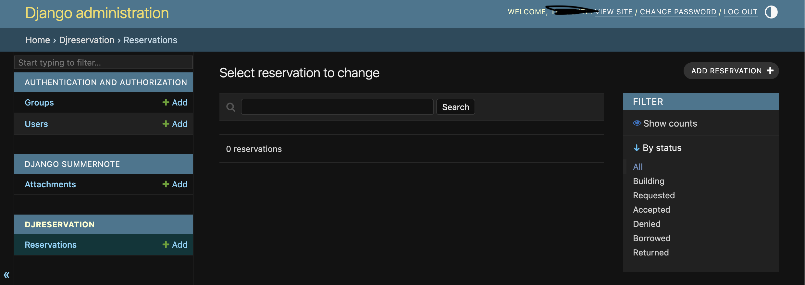
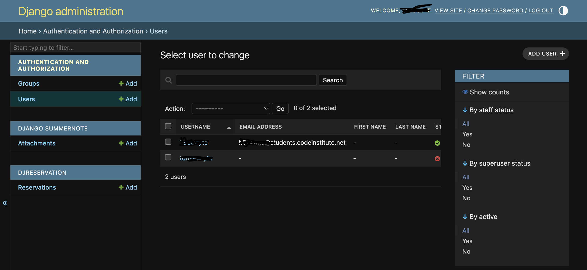

### Surface
My aim was to keep the font readable but to have some levity to match the style of restaurant. The lettering is clear against the light background. The idea was to invoke the idea of ketchup and mustard for the user since the restaurant serves hotdogs. 

The smaller text of the site will be black #000000 against the contrasting background of light yellow #feffcc to allow for readability. Some larger text will be burgundy #800017.

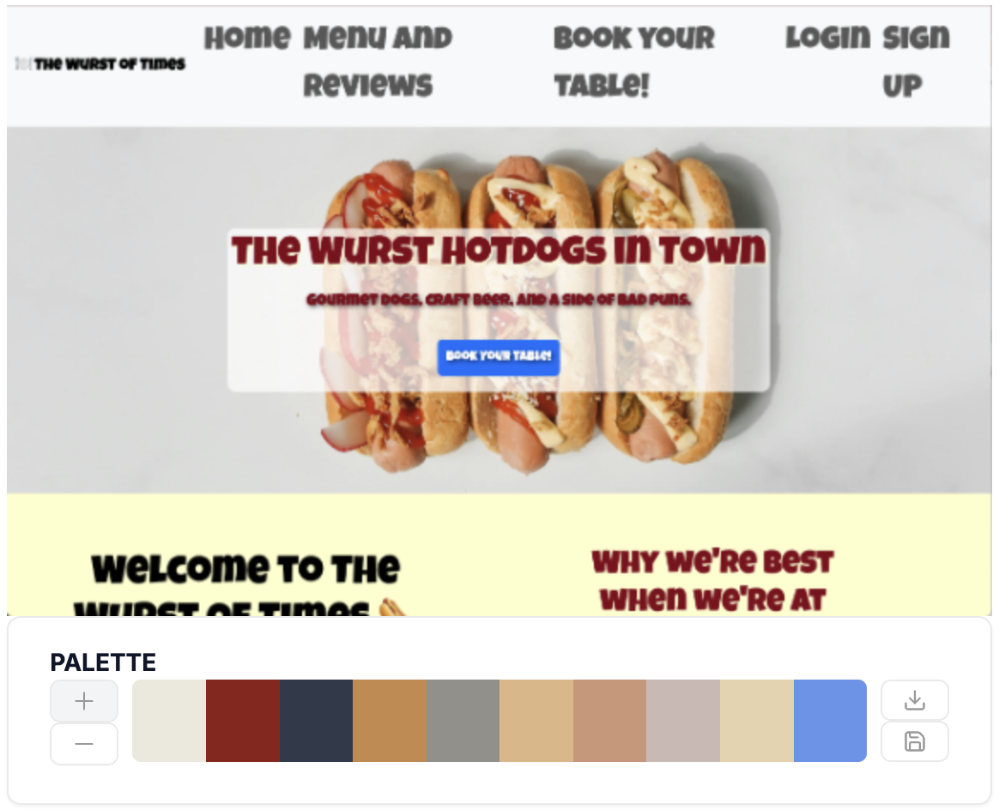
(https://imagecolorpicker.com/ used to create palettes)

#### Fonts
Primary font -  "Luckiest Guy", cursive
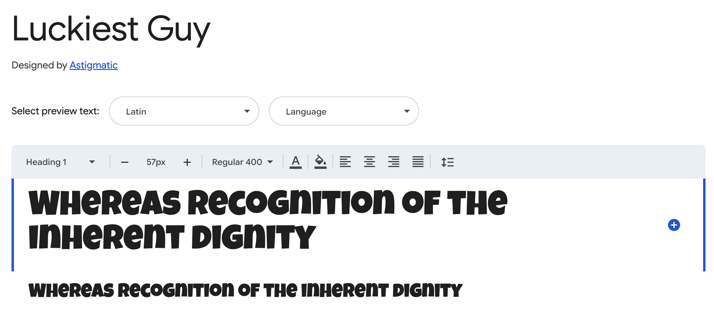

## 5. UI Design
## Initital design wireframes created using Balsamiq

Initial wireframe designs for pages 

## 6. Testing 

Website checked on Safari and on Chrome on desktop and on IOS (Apple mobile). No bugs observed between browsers. 

W3C Markup Validation Service 
(https://validator.w3.org/) used for HTML validation

Homepage (/home)
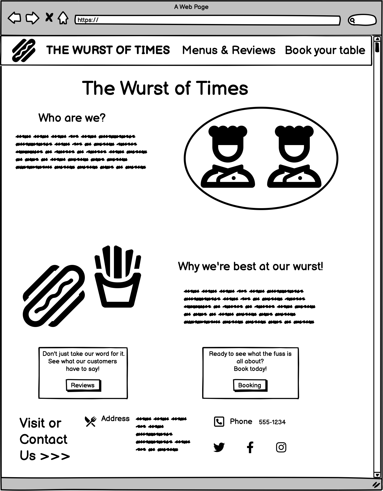
Menu and Reviews (/menu)
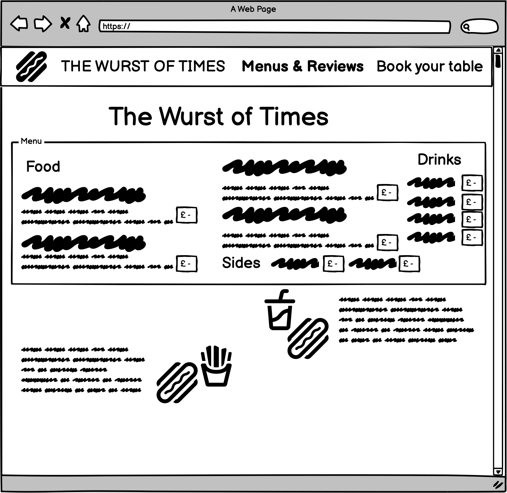
Booking (/reservations)
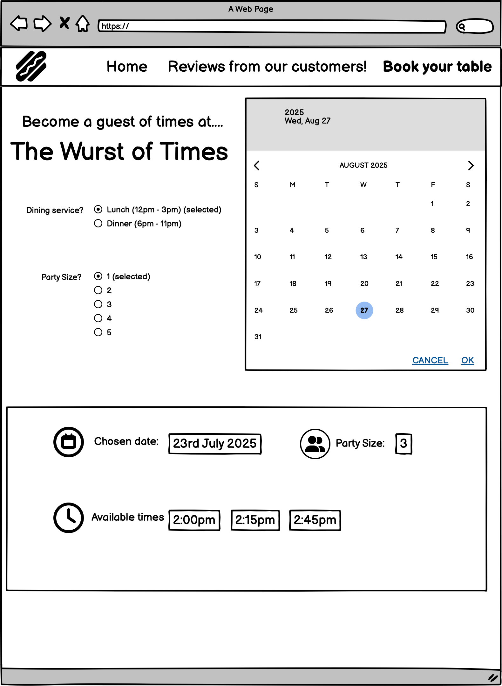

W3C CSS validation service
(https://jigsaw.w3.org/css-validator/) used for CSS validation.

JSHint JavaScript validation service
(https://jshint.com/) used for JS validation 

Lighthouse scores

Homepage (index.html)

Mobile scores

Home
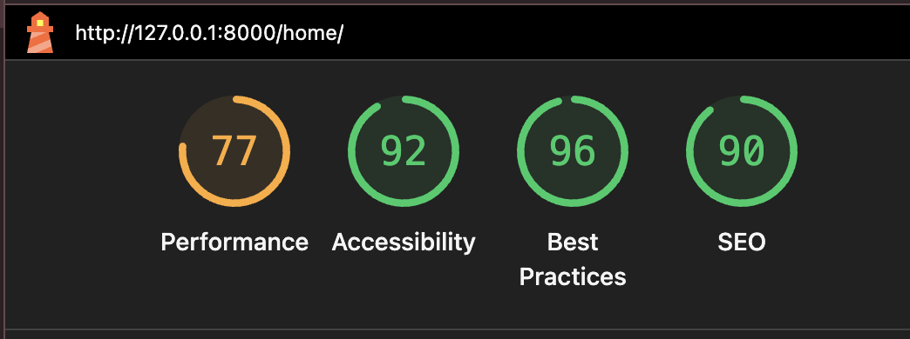

#### Issues
* Image is .webp and needs reformatting as .png to improve loading. 
* Hero image causes slowing
* Third-party scripts such as Bootstrap in base.html

Menu

Booking
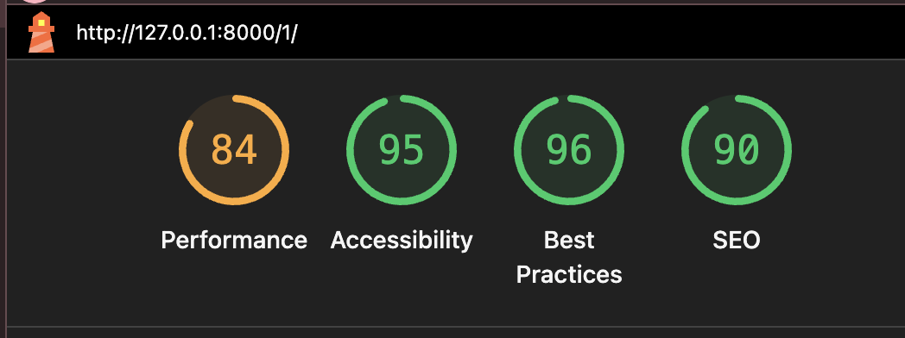
#### Issues
* Large layout shifts cause slowing between main section and footer. 
* Third-party scripts such as Bootstrap in base.html

Desktop scores

Home
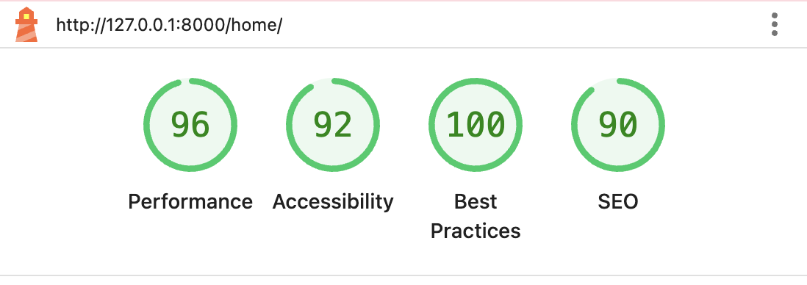

Menu
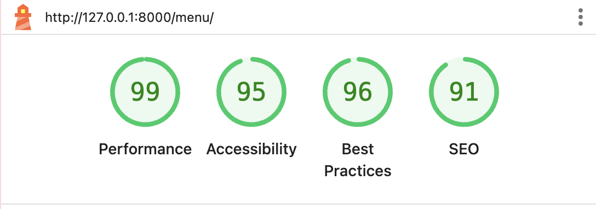

Booking
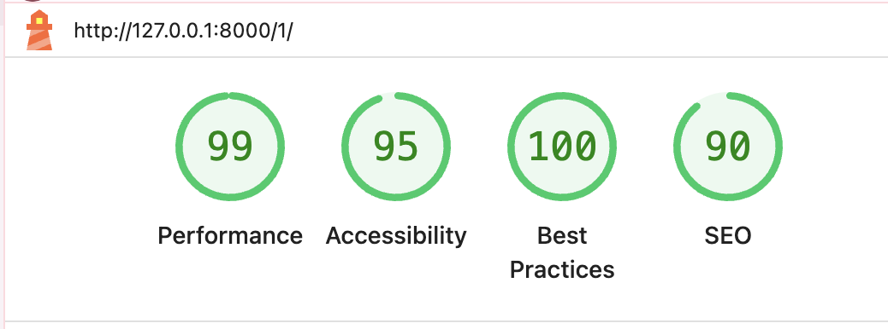

No significant issues slowing down loading.

### 2. Bugs Found and Resolved
1) 
2) 
3) 

### 7. Testing

## 8. Next Step Features	

Following the creation of the project, I would have liked to have created an area which could show a user their future bookings and give the user the option to cancel or amend their booking from the portal. 

Sending the bookings to GoogleSheets or GoogleCalendar for staff at the restaurant to view bookings would also have been useful. 

## 9. Coding Sources
* Code taken from Bootstrap v5.0 and heavily adapted/edited to fit needs of site (NavBar, buttons)
* Code Institute lessons - 
* Favicon was used to create the icon in page head.
* Balsamiq was used to create wireframes
* Responsive Viewer Chrome add-on was used for responsiveness screenshots

Django for Beginners (version 2.1) - Templates, Class-based views and URLS (Chapter 3), registration, log-in and authentication (Chapter 7)

https://docs.djangoproject.com/en/5.2/topics/db/models/  and https://www.w3schools.com/django/django_models.php - creating models in django

https://dj-booking.readthedocs.io/en/latest/ and https://pypi.org/project/dj-booking/ - dj-booking documentation 

https://stackoverflow.com/questions/64225732/how-to-get-time-slot-in-django-for-doctor-appointment - creating timeslot lists in django

https://stackoverflow.com/questions/68776480/django-store-actual-availability-and-query-the-available-schedule-for-new-bookin - cascading time slots and days of the week for booking form 

https://stackoverflow.com/questions/3367091/whats-the-cleanest-simplest-to-get-running-datepicker-in-django - inserting django datepicker plus to replace days of the week

https://docs.djangoproject.com/en/5.2/ref/forms/validation/ - clean data validation logic using super()

https://docs.djangoproject.com/en/5.2/ref/validators/ - raising validator errors in Django to prevent overbooking

https://realpython.com/python-getter-setter/ - Using @property setter to maintain ‘Number of People’ rather than amount in booking form. 

https://docs.djangoproject.com/en/5.2/topics/forms/modelforms/ and https://www.djangotricks.com/tricks/Swv44PDSrJYQ - Overriding the save method of the model form to allow ‘num_people’

https://stackoverflow.com/questions/9578906/easiest-way-to-combine-date-and-time-strings-to-single-datetime-object-using-pyt/9579030 - creating a single datetime element in forms.py  

https://www.devhandbook.com/django/templates/ - understanding html templates in django

https://stackoverflow.com/questions/14400035/how-to-return-a-static-html-file-as-a-response-in-django - linking and returning static html files in Django

https://stackoverflow.com/questions/74339432/attempting-to-read-pk-from-url-in-django-but-getting-error-noreversematch-at - url pk error explanation and resolution 

VSCode Co-Pilot was consulted to assist in migration errors and issues faced with creds.json and github. Assistance sought early on to configure STATIC settings and later to assist with implimentation of Whitenoise and amending of links within templates so they may be readable.

OpenAI consulted to assist with basic html template creation, then heavily adapted to suit project. Consulted for assistance in creating migrations to input table groups (5 indoors/5 outdoors) and creating dummy slot. Suggestions implimented to resolve 'available_amount' issue caused by djbooking system causing a pk error.  

## 10. Media Sources
<table>
  <caption>
    Images used within site
  </caption>
  <thead>
    <tr>
      <th scope="col">Photo Title</th>
      <th scope="col"> Relative Path </th>
      <th scope="col">Source Link</th>
      <th scope="col">Page Location</th>
    </tr>
  </thead>
  <tbody>
    <tr>
      <th scope="row">hotdog-hero.png</th>
      <td>static/css/images/hotdog-hero.png</td>
      <td></td>
      <td>/home</td>
    </tr>
     <tr>
      <th scope="row">pexels-godisable-jacob-226636-718978.webp</th>
      <td>booking_system_app/static/booking_system_app/pexels-godisable-jacob-226636-718978.webp</td>
      <td></td>
      <td>/menu</td>
    </tr>
    <tr>
      <th scope="row">pexels-olly-788567.webp</th>
      <td>booking_system_app/static/booking_system_app/pexels-olly-788567.webp</td>
      <td></td>
      <td>/menu</td>
    </tr>
     <tr>
      <th scope="row">pexels-olly-846741.webp</th>
      <td>booking_system_app/static/booking_system_app/pexels-olly-846741.webp</td>
      <td></td>
      <td>/manu</td>
    </tr>
  </tbody>
</table>

## 11. Acknowledgements 
* Dr Raghav Kovvuri (HE Lecturer- Computing at University Centre of Peterborough) for support and advice and understanding throughout the course. 
* Iuliia Konovalova, my wonderful, knowledgeable mentor. Thank you for trying to help stop my panic. 